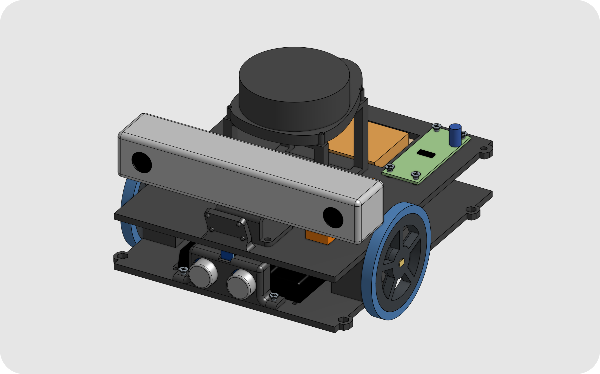
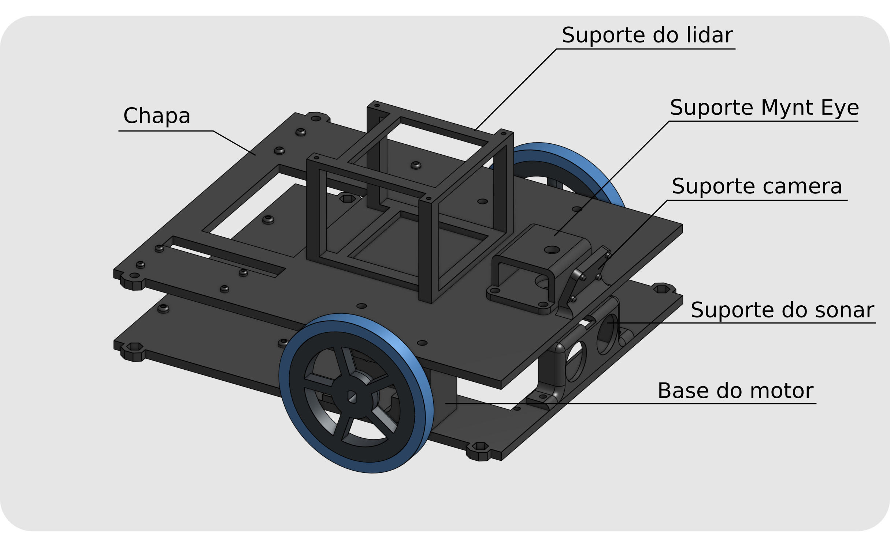
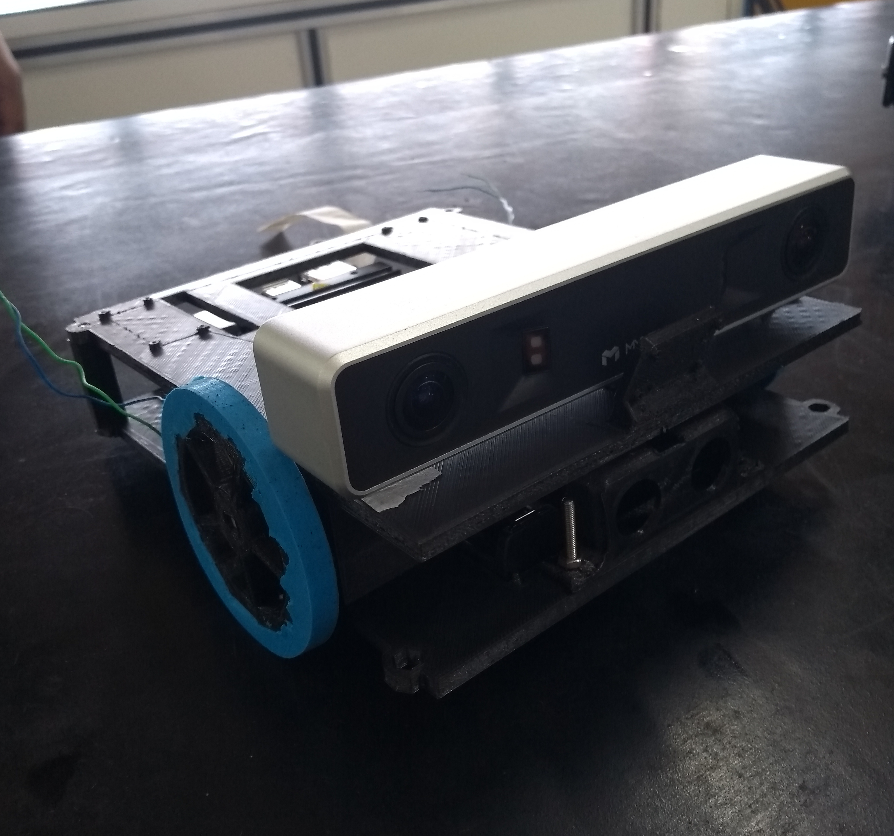
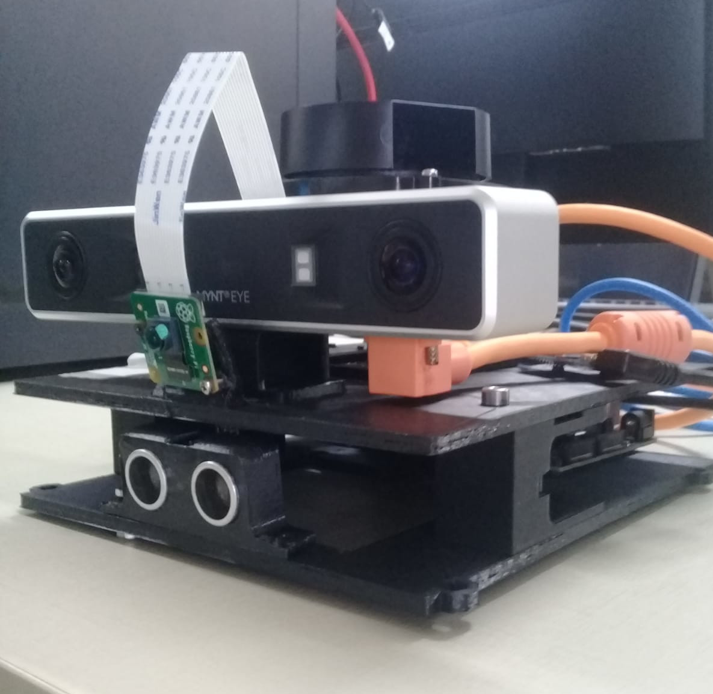

Uma das partes no desenvolvimento de um robô é o projeto e montagem das suas partes mecânicas. Em algumas situações é possível a utilização de plataformas de robótica prontas, mas em outros casos, devido a restrições como custo de aquisição ou especificidade da tarefa, é necessário o desenvolvimento de uma plataforma própria ou aperfeiçoamento de uma já existente.

O Hunter é um caso de aperfeiçoamento de plataforma, que foi inspirado no Jetbot e que necessitou de reprojeto de suas partes mecânicas, devido a quantidade de sensores a serem embarcados.

O projeto do robô passou por três versões e foi desenvolvida no Onshape. As duas primeira versões foram baseadas no chassis do próprio Jetbot e última foi projetado um chassis novo.

 
Imagem do projeto em 3D do Hunter realizado no Onshape, sendo a versão 3 do desenvolvimento.

### Chassis
O processo escolhido para confecção do chassis do robô, impressão 3D, permitiu que este fosse personalizado para as demais peças, como: motores, shields, PCB's e sensores. A figura abaixo mostra o chassis montado com apenas as peças que foram fabricas.

Devido a facilidade de impressão o material escolhido foi o PLA e as peças da figura 2 foram impressas em uma impressora Ultimaker 2. O video abaixo mostra o processo de impressão de uma das peças.

<iframe width="560" height="315" src="https://www.youtube.com/embed/ZitLNpdgK0I" title="YouTube video player" frameborder="0" allow="accelerometer; autoplay; clipboard-write; encrypted-media; gyroscope; picture-in-picture" allowfullscreen></iframe>

### Roda
Com o intuito de melhorar o contado do robô com o solo foi fabricado um pneu de silicone agregado à roda de PLA. 

Detalhe da roda impressa em PLA e pneu de silicone.

## Resultado

A montagem das peças fabricadas são apresentadas nas figuras abaixo.

 
Nesta figura podemos observa a montagem do chassis com rodas, motores e Mynt Eye.

 
Nesta imagem podemos observar as conexões dos sensores no robô.

 

---------------------
 

<!-- autor -->

<h3 class="post-title">Autor</h3> 

  

    <table class="table-borderless highlight">
      <thead>
        <tr>
          <th></th>
        </tr>
      </thead>
      <tbody>
        <tr class="font-weight-bolder" style="text-align: center margin-top: 0">
          <td>Caio Maia</td>
        </tr>
        <tr style="text-align: center" >
          <td style="vertical-align: top"><small>Bolsista no laboratório de   Robótica e Sistemas Autônomos (RoSA),  Senai Cimatec,  Engenheiro Eletricista.</small></td>
          <td></td>
        </tr>
      </tbody>
    </table>
  

 

