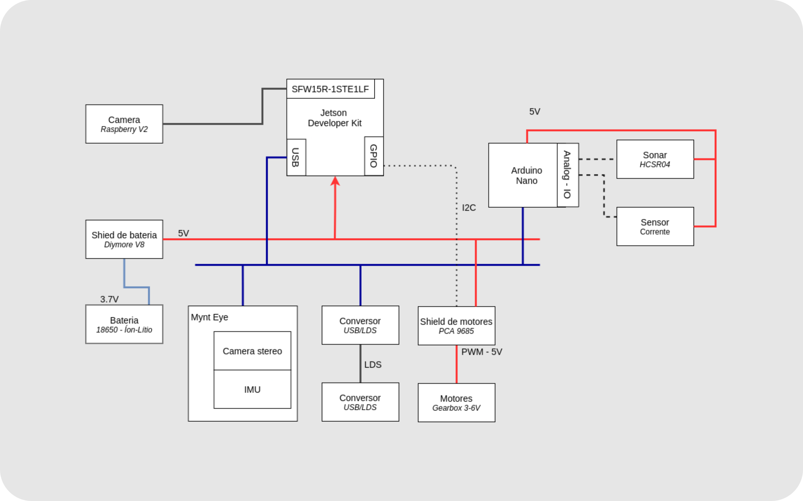
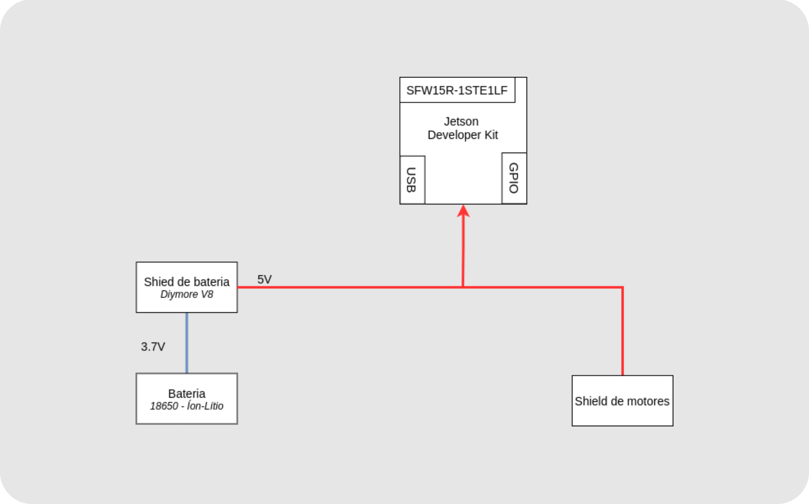
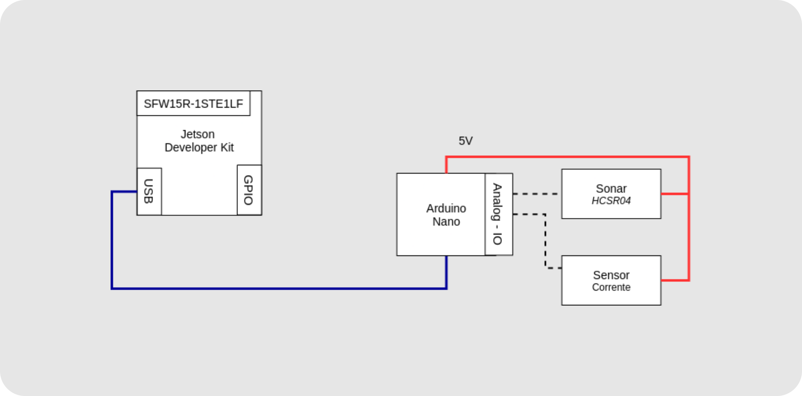
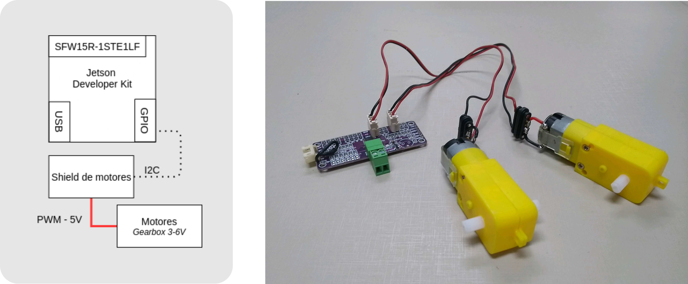
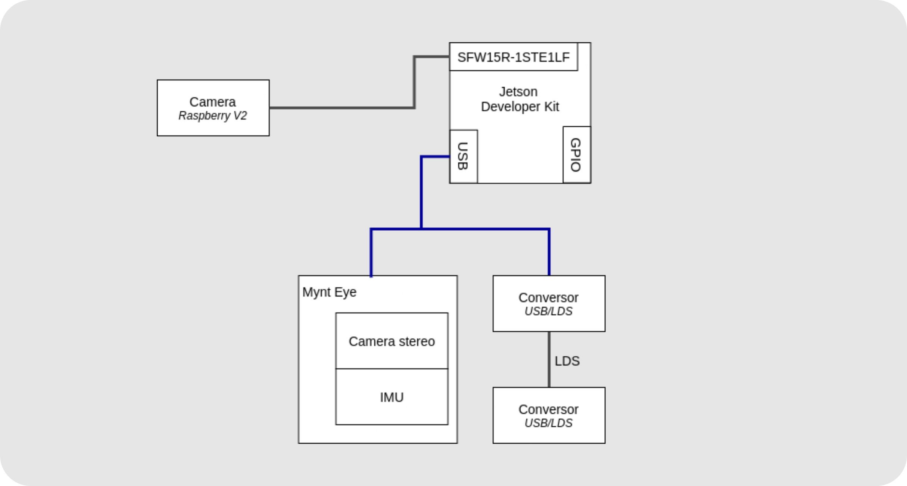

Um robô pode ser pensado como uma interconexão entre vários subsistemas e a maioria destes utiliza fontes de energia elétrica para o seu funcionamento. Deste modo é importante que estas conexões sejam bem pensadas e executadas, sob o risco de mal funcionamento do robô em um momento crítico, como UAV durante o voo.
Tratando-se deste sistema eletro-eletrônico, os documentos que direcionam a montagem do robô, no nosso framework de projeto, são os diagramas elétricos e os diagramas eletrônicos. Os diagramas elétricos tem o objetivo de detalhar as conexões entres o os componentes: tipos de cabos, conectores, etc, enquanto os diagramas eletrônicos são o detalhamento das placas eletrônicas que venham a ser confeccionadas.
No projeto do Hunter não foi necessária a criação de placas eletrônicas, sendo o seu projeto composto apenas dos diagramas elétricos. O resumo do esquema elétrico do Hunter pode ser visto no Diagrama de Comunicação e Elétrica.

## Montagem da Alimentação Elétrica

A alimentação elétrica do sistema é feita por meio de um shield de baterias Diymore V8, que recebe duas bateria de Íon-Lítio de 3,7 V e realizam a conversão para saídas de 5V e 3V. No caso do Hunter apenas a saída de 5V com interface USB 2.0 é utilizada. Esta saída é conectada a um cabo que alimenta o Jetson Nano Developer Kit e a parte de força do shield de motores. Existe ainda a conexão de um sensor de corrente para monitoramento desta saída.

## Montagem Arduino

No projeto é utilizado um Arduino para desacoplar o funcionamento de alguns sensores. Esta escolha foi para que sejam utilizada portas analógicas, inexistentes na Jetson.
São conectados dois periféricos ao Arduino, que são: sensor ultrassônico, sensor de corrente. A conexão entre a Jetson e o Arduino é feita por meio de um adaptador USB. Já as outras duas conexões precisaram da confecção de  cabos

Diagrama de conexões para a ligação entre a Jetson e os sensores, por meio do Arduino Mini.

## Montagem do Sistema de Atuação

## Montagem dos Demais Sensores

Os demais senores são conectados com cabos USB, para o caso do lidar e camera stereo, e com cabo flat de 15 vias, para o caso da câmera Raspberry V2, e possuem montagem simples.

