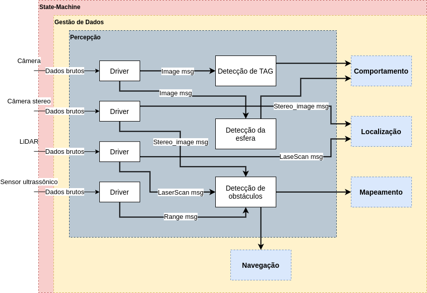
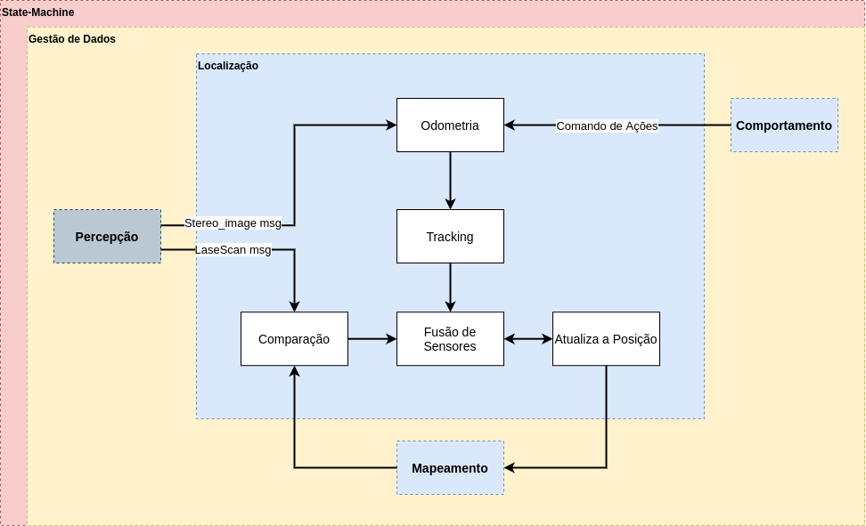

Para o desenvolvimento do <b>Vertbot</b>, é necessário se ter em mente quais funções o robô tem que ter para a realização de cada atividade que for atrelada a ele, sendo possível que ele tome decisões próprias para qualquer situação que ele se envolva. Para isso, foi desenvolvido um diagrama para listar todas as funções e a relação entre elas, proporcionando uma boa compreensão de como o sistema final será e como ele deve ser desenvolvido. A seguir serão apresentadas as funcionalidades apontadas no projeto, como elas afetam o sistema tanto na comunicação com a parte externa quanto na tomada de decisão e computação dos algoritmos.

### Percepção

{: width="100%"}

O sistema de percepção do Vertbot é composto por um conjunto de sensores responsáveis pela percepção dos estímulos externos ao robô, como distâncias e imagens, e pelo processamento e tratamento dessas informações para estabelecer comunicação com outras funcionalidades, como localização, comportamento, navegação e mapeamento.

O processo é iniciado com a recepção dos dados brutos oriundos no mundo externo ao robô pelo conjunto de sensores, seguido pelo processamento dessas informações nos drivers dos sensores.

O conjunto de sensores é composto por um sensor ultrassônico, um LiDAR 2D, uma câmera estéreo e uma câmera de alta resolução. O sensor ultrassônico é responsável pela detecção de obstáculos na trajetória do robô,  baseada na distância calculada de objetos para o robô. A câmera estéreo, que é equipada com uma IMU, é responsável pela localização do Vertbot, baseada na odometria, realizada na funcionalidade de localização, e também pela detecção de obstáculos. Enquanto que as informações processadas pelo LiDAR são responsáveis pelo mapeamento. Por fim, a câmera de alta resolução é utilizada para realizar a detecção da esfera, sendo essa a missão do robô, e pela detecção de marcos fiduciais (TAG's).

### Localização

{: width="100%"}

A localização é a funcionalidade responsável por monitorar e atualizar a posição e orientação do robô no espaço em que ele está inserido. A odometria é realizada através das informações fornecidas pela câmera estéreo, sendo essas informações armazenadas para gerar o tracking, que é o rastreio do robô através da movimentação dos motores. As informações do LiDAR e do mapa global geradas até o momento são comparadas, tendo suas informações fundidas com o o tracking, para confirmar a posição e orientação atual do robô.

---------------------
 

<!-- autor -->

<h3 class="post-title">Autor</h3> 

  

    <table class="table-borderless highlight">
      <thead>
        <tr>
          <th></th>
        </tr>
      </thead>
      <tbody>
        <tr class="font-weight-bolder" style="text-align: center margin-top: 0">
          <td>Breno Portela</td>
        </tr>
        <tr style="text-align: center" >
          <td style="vertical-align: top"><small>Engenheiro Mecânico - Senai Cimatec. Líder da équipe Vertbot.</small></td>
          <td></td>
        </tr>
      </tbody>
    </table>
  

 