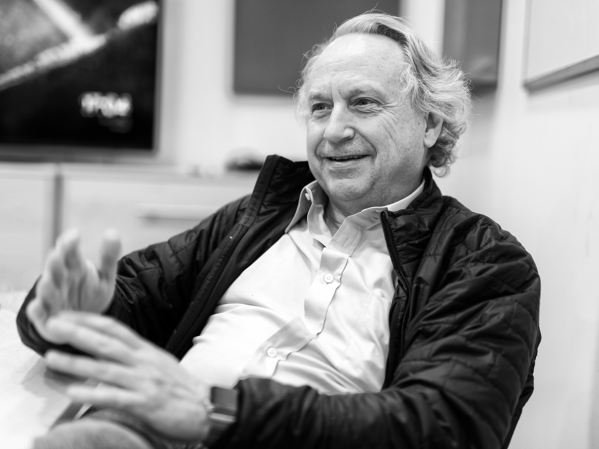
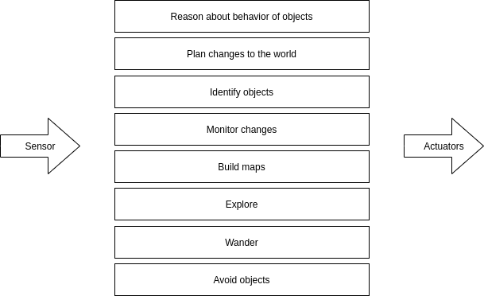
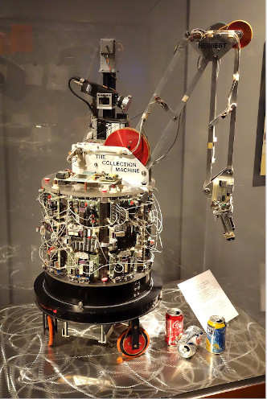

<!-- ## Introdução -->

Uma das áreas mais promissora atualmente é a robótica. Parte disto decorre da expectativa de ganho de produtividade para quando robôs forem intensamente integrados às cadeias produtivas. Outra parte decorre dos avanços recentes em tecnologias que amparam o desenvolvimento da área. Embora avanços sejam comunicados por meio de artigos científicos recentes, existem ideias que são menos recentes mas que representaram um grande passo na construção de novos caminhos tecnológico. Ums destes passo é o artigo do **A Robust Layered Control System for a Mobile Robot** [[1]](https://ieeexplore.ieee.org/document/1087032) do Rodney A.Brooks. Onde este apresenta uma nova forma de enxergar a estrutura de controle de um robô móvel inteligente. Este artigo em particular possui mais de 4000 citações indexadas na Scopus e influenciou a forma com que os robôs móveis são pensados quanto a sua estrutura de controle e decisão. Além de pesquisador influente, Brooks é empreendedor e fundou a [iRobots](https://www.irobot.com/) e [Rethink Robotics](https://www.rethinkrobotics.com/).

A principal ideia presente no artigo é a de que as tarefas com que o robô deve lidar devem ser estratificadas em camadas, de modo que, as camadas inferiores sejam incumbidas de tarefas mais elementares, enquanto o acréscimo de camadas ampliará as capacidades ao robô. Esta estrutura, também conhecida como *Subsumption Architecture*, apresenta as vantagens de aumentar a robustez, flexibilidade.

O aumento de robustez decorre da possibilidade de colocar vários sensores no robôs, bem como a possibilidade de camadas inferiores não serem afetadas pelo não funcionamento das superiores. Quanto a flexibilidade, como cada camada funciona de modo quase independente, com sua própria máquina de estados finita e tendo acesso aos sensores e atuadores, esta apresenta um menor acoplamento entre camadas.

Algo parecido com esta ideia é utilizados no [ROS](https://www.ros.org/), onde a estrutura de controle do robô se ampara em um processamento descentralizado e onde as tarefas múltiplas do robô são distribuidas nos nós. Isto permite por exemplo que um nós se ocupe de oferecer interface de teleoperação, outro de controlar o motores, outros de montar o mapa, etc. No artigo ainda o autor realiza alguns testes práticos e simulações, de modo comprovar a factibilidade de sua proposta e obtém sucesso em fazer com que o robô vague por um corredor do laboratório sem colidir com obstáculos.

A pesquisa e leitura deste artigo foi motivada como parte do programa de formação do Centro de Competência em Robótica e Sistemas Autônomos e teve como resultado, além desta postagem, uma apresentação e um mapa conceitual. Tanto o mapa conceitual como a apresenta podem ser acessados pode meio deste [link](https://drive.google.com/drive/folders/1fT1c9rIHpcIFqOXKjt3zqwlo6zUpnSRg?usp=sharing).

 

<!-- autor -->

<h3 class="post-title">Autor</h3> 

  

    <table class="table-borderless highlight">
      <thead>
        <tr>
          <th></th>
        </tr>
      </thead>
      <tbody>
        <tr class="font-weight-bolder" style="text-align: center margin-top: 0">
          <td>Caio Maia</td>
        </tr>
        <tr style="text-align: center" >
          <td style="vertical-align: top; text-align: justify"><small>Pesquisador Júnior no Centro de Competências em Robótica e Sistemas Autônomos do Senai Cimatec. Apaixonado por robótica e computadores, sonha em tornar o mundo um lugar melhor por meio da tecnologia e do empreendedorismo. Gosta de transformar ideias em coisas reais e quem sabe um dia funde um startup. Caio é formado em engenharia elétrica pela UESC.</small></td>
          <td></td>
        </tr>
      </tbody>
    </table>
  

 
