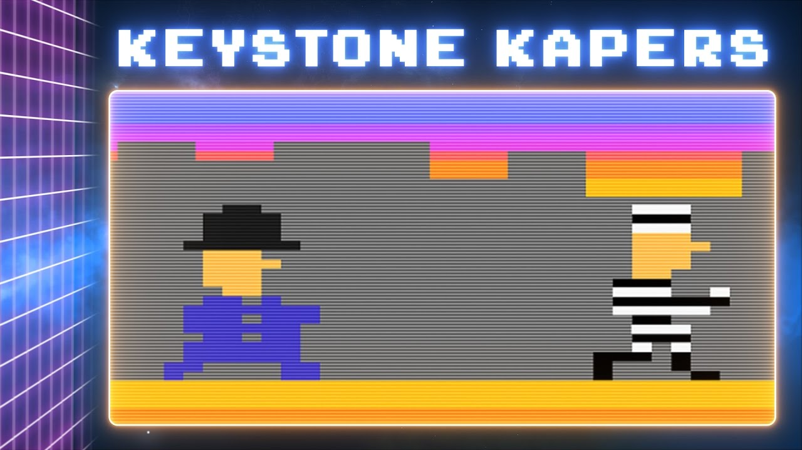
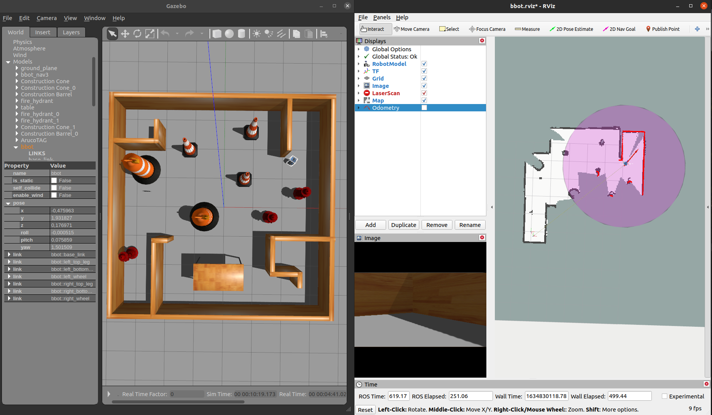
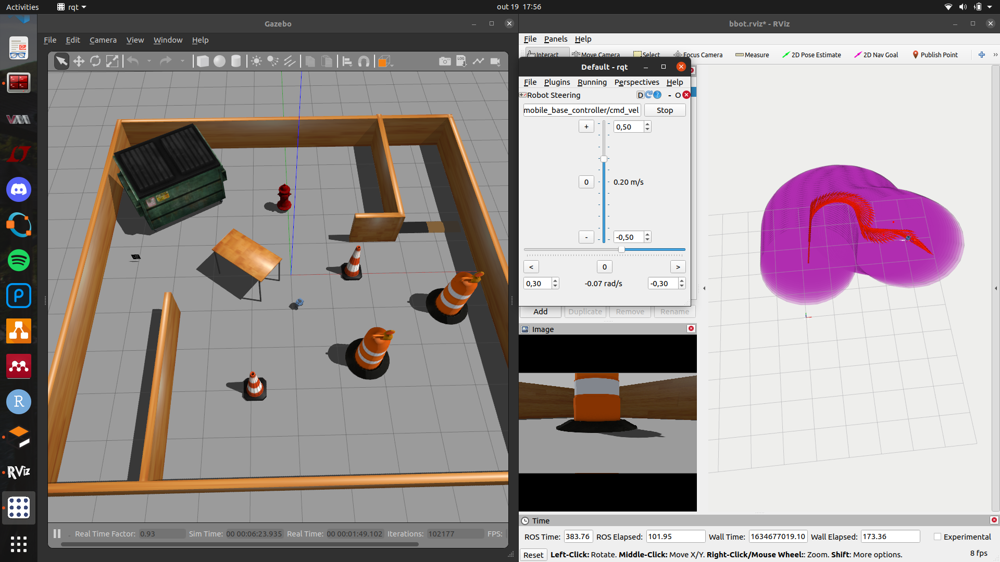
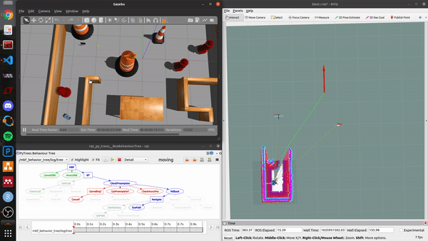

<!------------------------------------------------------------------- 
>  Intro:
>    - Qual a missão
>
>  Implementação:
>    - Como foi implementada
>    - Quais pacotes do ROS foram usados
>    - Por que behavior tree e qual sua função
>
>  Simulação:
>   - Mostrar vídeos da simulação
>
>  Conclusão:

{:.center}

------------------------------------------------------------------->

Recentemente, nós mostramos como implementamos o controlador LQR no robô real e os resultados que chegamos. No post, que recomendamos checarem clicando [nesse link](https://mhar-vell.github.io/rasc/2021-11-26-bbot-first-time-standing/), nós falamos que o Bbot foi pensado para ser um robô capaz de ler TAGs via visão computacional e navegar autonomamente em um ambiente desviando de obstáculos. Essas funcionalidades ainda não foram implementadas no protótipo real, mas na simulação sim. Hoje, pretendemos contar um pouco sobre essa simulação e mostrar com mais detalhes a missão do bbot.

## A missão

Na nossa [página oficial](https://mhar-vell.github.io/rasc/project-bbot/), damos uma breve descrição da missão do Bbot. Mas, caso você ainda não tenha checado, o Bbot é um robô *self-balancing* que, além de se equilibrar e se deslocar sobre duas rodas, deve ser capaz de realizar a leitura de uma TAG (marco fiducial, veja imagem abaixo), que enviará ao robô uma posição de destino à qual ele deve navegar de forma autônoma. Para realizar a navegação, esse robô deverá ser capaz de criar um mapa do local onde está e se localizar nele, permitindo-o atualizar sua posição ao longo da missão e desviar de obstáculos enquanto navega até seu objetivo.

### Leitura da TAG

Para fazer a leitura da TAG, nós utilizamos um pacote do ROS que já tem essa funcionalidade implementada, desenvolvido aqui em nosso laboratório. Além de conter todo o algoritmo de visão computacional, ele já faz uso da interface do ROS, publicando uma TF (basicamente uma posição em relação a um referencial). Fazendo isso em tempo real, é possível utilizar essa informação facilmente em outros `rosnodes` implementados no sistema. Sabendo a distância do robô até essa TAG, e sabendo a localização da TAG no espaço, passamos ao robô uma posição de referência a qual ele deve navegar de forma autônoma.

{:.center}

### SLAM

Para conseguir navegar no ambiente, o robô precisa, primeiramente, saber onde está e, caso queria desviar de obstáculos, precisa saber onde estão os obstáculos no espaço. Criar um mapa do ambiente e, ao mesmo tempo, se localizar nele é um problema bastante relevante na área da robótica chamado SLAM (Simultaneous Localization and Mapping). O ROS contém vários pacotes com algoritmos de SLAM implementados. Um dos mais utilizados é o `gmapping`, que utiliza a leitura de sensores laser para identificar obstáculos no ambiente e criar um mapa com informações sobre onde o robô pode navegar e onde estão os obstáculos. Além disso, o algoritmo também calcula, com base no deslocamento das leituras do laser coletadas entre um pequeno intervalo de tempo, uma estimativa da posição do robô. Esse algoritmo é bastante poderoso e nós o implementamos no Bbot. 

Abaixo é possível ver uma das imagens geradas da simulação, na qual da para comparar o ambiente simulado, a esquerda, e o mapa gerado, a direita.

{:.center}

### Odometria

Odometria é o uso de dados para estimar a velocidade e posição de um corpo no espaço. Parece algo semelhante ao SLAM, porém é mais abrangente. Odometria não pressupõe a criação de um mapa, tratando-se apenas da estimativa de deslocamento do robô no espaço. Para que o `gmapping` consiga recriar o mapa do ambiente com base dos dados do laser, ele precisa juntar todas as leituras de forma a registrar pontos onde o laser retornou (obstáculos) e descartar os pontos onde não houve retorno da luz (espaço livre). Para isso, é preciso saber o quanto o robô se deslocou, a fim de que essa "colagem" de informações do laser (o que seria o mapa), seja feita de forma correta e o ambiente seja recriado da forma mais verídica possível ao ambiente real. Portanto, o `gmapping` já faz isso, qual o motivo de destacar isso mais uma vez? A questão é que como se trata de uma estimativa, pode haver erros, que quando se acumulam, atrapalham a navegação, passando ao robô informações erradas do ambiente e de sua localização. Para solucionar isso, nós fazemos uma fusão de sensores, e juntamos leituras de várias fontes a fim de ter a melhor estimativa possível da informação que queremos. Um ferramenta excelente para isso é um Filtro de Kalman (falamos um pouco sobre ele no [último post](https://mhar-vell.github.io/rasc/2021-11-26-bbot-first-time-standing/)). O pacote do ROS `robot_localization` implementa uma variação chamada filtro de Kalman extendido, com base no modelo de uma plataforma móvel. Assim, podemos fornecer para ele informações de várias fontes de odometria e IMUs, a fim de ter uma melhor estimativa da posição e velocidade do robô. O Bbot conta com encoders em suas rodas e um IMU, sendo essa as fontes de dados que fornecemos ao `robot_localization`. 

Abaixo há uma imagem que mostra o robô no mundo virtual e a trajetória feita por ele, representada pelas setas vermelhas ao longo do tempo.

{:.center}

### Move Base Flex + PyTrees

Se você já tiver tentado implementar navegação autônoma em um robô usando ROS, provavelmente já ouviu falar ou já usou o `move_base`. Trata-se de uma interface de navegação autônoma que, com base em um mapa do ambiente, a posição atual do robô nele e uma posição de destino, consegue calcular uma trajetória até este ponto, desviando de obstáculos, e, através de um controlador, enviar comandos de velocidade para o robô, a fim de guiá-lo até seu objetivo. O `move_base` é outra excelente ferramenta fornecida no ROS, contudo, possui algumas falhas, principalmente quando o algoritmo falha em guiar o robô. Portanto, foi criado uma outra interface de navegação muito semelhante, com os mesmos algoritmos de base, porém mais flexível, permitindo a nós desenvolvedores ditar o comportamento do robô em caso de falha de planejamento, ou falha de controle, o que torna o sistema muito mais robusto. Esse é o `move_base_flex`. E para gerenciar todas essas tarefas de planejar trajetória, guiar robô pela trajetória, identificar erros e corrigir esses erros, fazemos uso de uma arquitetura de controle muito versátil, chamada Behavior tree. O pacote `py_trees` implementa essa arquitetura em Python e, através no `py_trees_ros`, conseguimos utilizar algumas funcionalidades do ROS em nossa Behavior tree. 

Também através da Behavior Tree, conseguimos usar os dados de detecção da TAG (a posição do robô relativa a ela) para passar um objetivo ao robô. Porque podem ocorrer erros de detecção e a posição da TAG pode ser atualizada, devemos atualizar a posição de destino também. Essa é outra funcionalidade implementada no Bbot, via a Behavior Tree.

Se você nunca ouviu falar de nenhum desses pacotes ou conceitos antes, e queira se aprofundar mais, sugiro checar os links abaixo:

1. [Gmapping](http://wiki.ros.org/gmapping)
2. [Robot localization](http://wiki.ros.org/robot_localization)
3. [Move base Flex](http://wiki.ros.org/move_base_flex)
4. [py_trees](https://py-trees.readthedocs.io/en/devel/introduction.html)
5. [py_trees_ros](http://docs.ros.org/en/noetic/api/py_trees_ros/html/about.html)

## Simulação

Após implementar odometria, SLAM, detecção de TAG e navegação autônoma gerenciada via uma Behavior Tree, seguimos com a simulação do robô. Abaixo, é possível ver alguns gifs e vídeos que fizemos, demonstrando a operação do Bbot.

{:.center}

Diferente da imagem mostrada no item do `gmapping`, nessas, os obstáculos possuem um envoltório colorido. Este é uma região criada pelo pacote do ROS `costmap2d`, o qual o `move_base_flex` utiliza, para ampliar o tamanho dos obstáculos de forma que o controlador de trajetória tente evitar essas regiões. 

<iframe width="560" height="315" src="https://www.youtube.com/embed/r0i4qWGY8_Y" title="YouTube video player" frameborder="0" allow="accelerometer; autoplay; clipboard-write; encrypted-media; gyroscope; picture-in-picture" allowfullscreen></iframe>

Embora tenhamos falado um pouco sobre as melhorias que pretendemos implementar no modelo real do Bbot, no último post, para que ele consiga realizar sua missão final, não falamos muito sobre a missão. Espero que esse post tenha esclarecido mais os planos que temos para este robô e o caminho que pretendemos seguir até lá. O Bbot é um projeto em andamento e voltaremos a postar assim que tivermos mais atualizações

----------------

 

<!-- **************************************** Autor **************************************** -->

<h3 class="post-title">Autor</h3> 

  

    <table class="table-borderless highlight">
      <thead>
        <tr>
            <th>
<a href="https://www.linkedin.com/in/lucas-lins-souza-51b1909a/" target="_blank">
                

                    
                

            </a>
</th>
        </tr>
      </thead>
      <tbody>
        <tr class="font-weight-bolder" style="text-align: center; margin-top: 0">
          <td width="33.33%">Lucas Lins</td>
        </tr>
        <tr style="text-align: center" >
          <td style="vertical-align: top;text-align: justify;"><small>Pesquisador Júnior (estagiário) no laboratório de Robótica e Sistemas Autônomos (RoSA), Senai Cimatec, graduando em Engenharia Elétrica.</small></td>
        </tr>
      </tbody>
    </table>
  

 

<!-- **************************************** MATH script **************************************** -->

