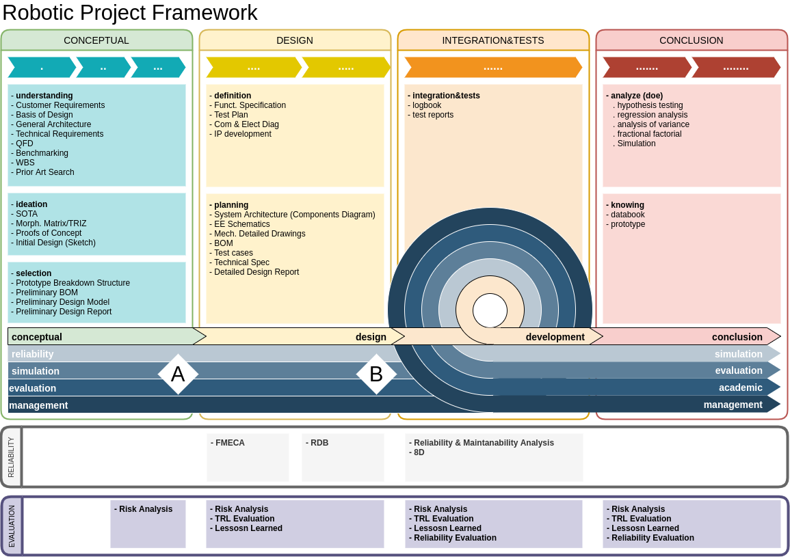
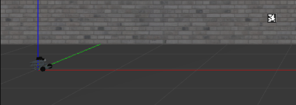
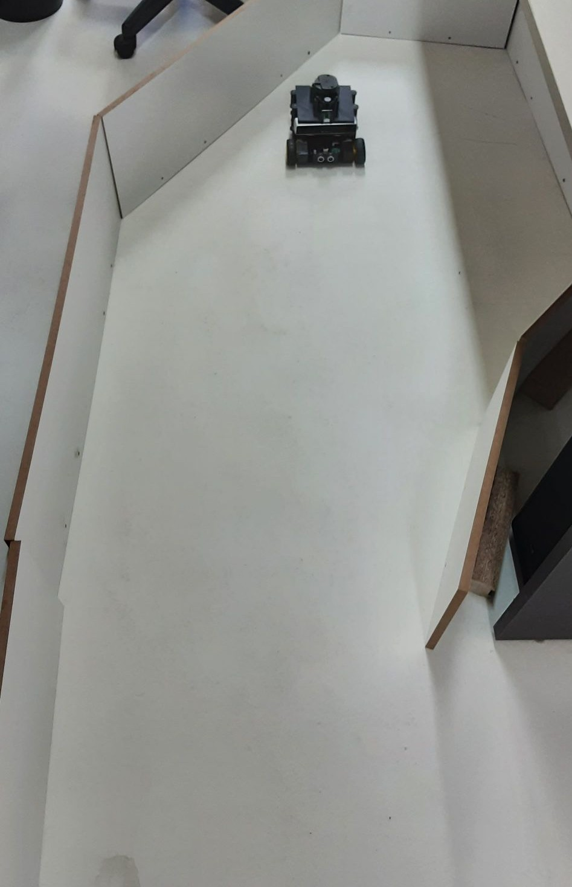
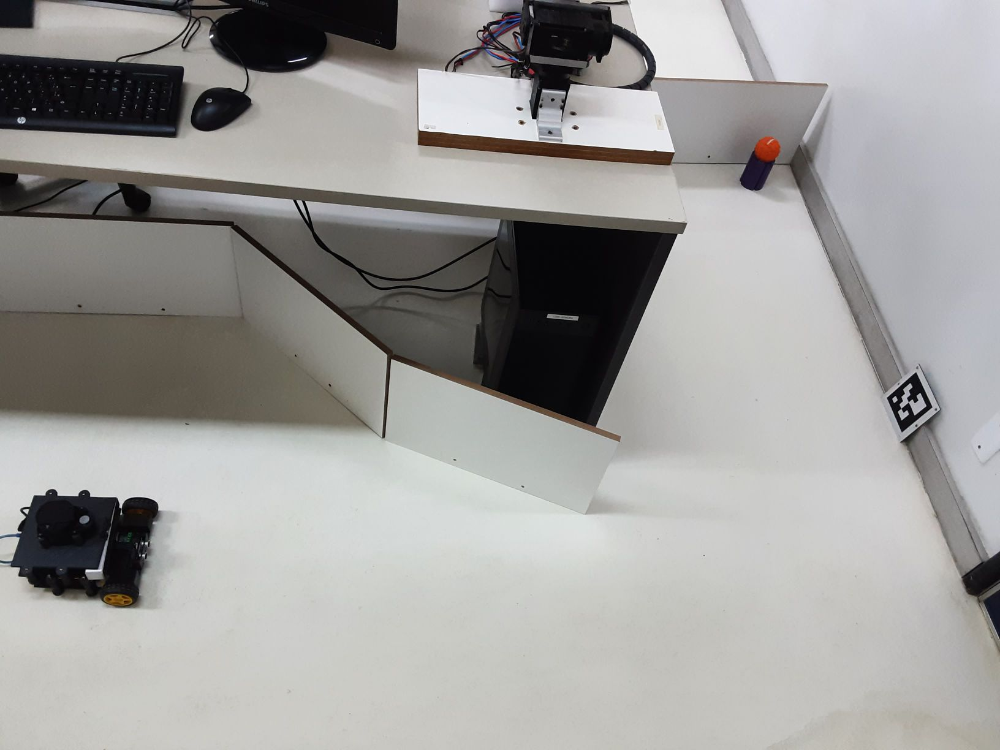

## Conclusão do Projeto APEREA

Durante 3 meses de desenvolvimento o robô móvel  APEREA foi idealizado,  montado,  e testado (várias vezes e várias vezes) para alcançar o objetivo.  
O Projeto APEREA foi finalizado com sucesso. A conclusão chegou ao ponto final com uma apresentação da realização da missão do robô para um público de jovens pesquisadores e desenvolvedores roboticistas pertencentes ao  RASC.

Um fator que ajudou bastante a realização do projeto foi o gerenciamento deste. O Projeto foi dividido em 5 partes: conceitual, design, integração e testes, conclusão e simulação. Na parte conceitual, foram feitas atividades voltadas para ter os primeiros requisitos do projeto, materiais e características. A Idealização foi dedicada para enxergar  o  projeto diante de uma visão técnica, um exemplo de atividade foi o mapeamento das funcionalidades que o robô deve ter.

{:.center}

 

A simulação foi iniciada  logo no início do projeto. Durante a simulação algumas características do robô foram notadas, e essas observação foram consideradas na  fase de integração e teste. Esta última fase, a mais longa de todas, foi dedicada à montagem do APEREA e dos testes necessários para aumentar a chance de missão ser executada  e realizada com sucesso. A última etapa foi dedicada para documentar o projeto. O gerenciamento foi fundamental para o sucesso, pois, além de acompanhar o andamento de cada fase, permitiu que os membros do projeto atenuassem os eventos inesperados com eficiência.

{:.center}

A integração, dedicada à montagem, e a  simulação foram duas fases que estavam fortemente ligadas. As características do robô na simulação foram de acordo com o robô físico. A simulação permitiu observar, ou melhor, prever, problemas que seriam enfrentados com o robô real. Um exemplo de problema foi  a posição do centro de massa, que durante os primeiros ensaios virtuais, foi notado uma influência  indesejada na navegação e estabilidade do robô. Após esta verificação foi considerada um alteração no desenho mecânico para evitar que este problema acontecesse também no robô físico.

A última etapa do projeto foi a demonstração do robô APEREA realizando a missão, foi  montado um ambiente com a tag e a esfera colorida. O APEREA foi capaz de procurar e  identificar a TAG e depois se deslocar até   onde estava a esfera. O projeto concluiu com a implementação de técnicas de navegação, para o robô percorrer o ambiente da missão, e de visão computacional dedicados para identificação da TAG e da esfera. Mais implementações podem ser feitas no APEREA, já que estes detêm a placa Nvidia JetsonNANO que permite a aplicações de técnicas de inteligências computacionais, ao exemplo da utilização da rede neural YOLO 4 para identificar objetos presentes em um ambiente.  

{:.center}

 

 {:.center}

 
<iframe src ="https://drive.google.com/file/d/1sJbdCBRDE-u0sCOWbjafkJ90CVuxu7Z5/preview" width='740' height='430' allowfullscreen mozallowfullscreen webkitallowfullscreen></iframe>

 

---------------------
 

<!-- autor -->

<h3 class="post-title">Autor</h3> 

  

    <table class="table-borderless highlight">
      <thead>
        <tr>
          <th></th>
        </tr>
      </thead>
      <tbody>
        <tr class="font-weight-bolder" style="text-align: center margin-top: 0">
          <td>Matheus Anselmo</td>
        </tr>
        <tr style="text-align: center" >
          <td style="vertical-align: top"><small>Pesquisador Jr. do projeto  Engenheiro de Controle e Automação.</small></td>
          <td></td>
        </tr>
      </tbody>
    </table>
  

 