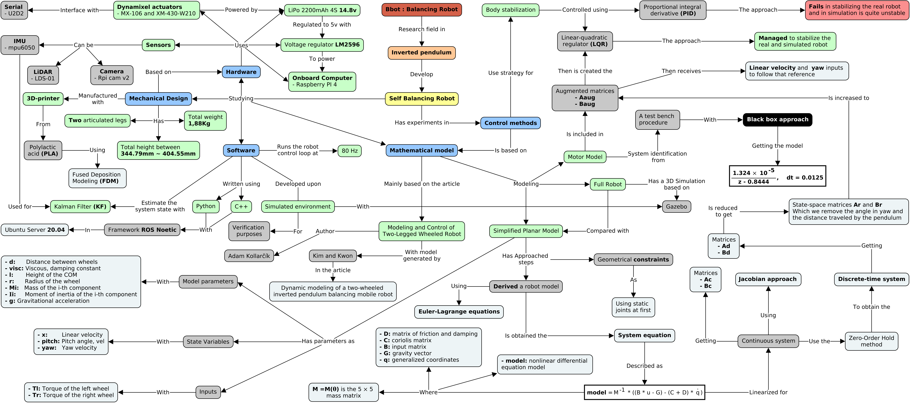

Através do mapa conceitual é possível  visualizar as principais ideias e conceitos abordados no Bbot e a relação entre estes pontos. Este mapa foi desenvolvido com o objetivo de destacar os principais pontos do projeto e facilitar o seu entendimento.

{:.center}
{:target="_blank"}

Como última etapa de desenvolvimento do [projeto Bbot](https://mhar-vell.github.io/rasc/project-bbot/), decidimos realizar mais alguns ajustes no controlador para que o robô conseguisse desenvolver uma estabilidade mais suave. 

Durante alguns testes, para implementar a função de teleoperação do robô, percebemos que a leitura de velocidade linear estava errada. Os valores eram muito mais elevados do que o robô poderia alcançar. O erro era na conversão entre o dado do encoder dos Dynamixels para rad/s. Ao corrigir esse erro, o comportamento do controlador mudou bastante, fazendo necessária novamente a sintonização do controlador. Observamos também que a mudança deste parâmetro causou muita trepidação no robô, muito mais do que ele estava.

Fizemos então um **filtro média móvel** para tentar atenuar o sinal de controle vindo do controlador, porém, embora a resposta tenha ficado menos oscilante, o controlador ficou mais fraco. Então continuamos ajustando os parâmetros do controlador até chegar em um valor ideal para que o robô ficasse mais estável. 

Por fim, conseguimos parametrizar o controlador de forma ideal e **o robô consegue se equilibrar** sem trepidações e está muito mais estável!! 

{:.center}
<iframe width="720" height="315" src="https://www.youtube.com/embed/L74pwDNFQ-Q" title="YouTube video player" frameborder="0" allow="accelerometer; autoplay; clipboard-write; encrypted-media; gyroscope; picture-in-picture" allowfullscreen></iframe>

Aṕos mais alguns ajustes no kalman filter e na parametrização do controlador, conseguimos teleoperar o Bbot!! Fizemos testes com a teleoperação em um labirinto e com obstáculos, que foram superados pelo Bbot. Testamos também o robô ao subir uma rampa. Todos esses testes podem ser vistos abaixo.

{:.center}
<iframe width="720" height="315" src="https://www.youtube.com/embed/Q13y1XcuO6Q" title="YouTube video player" frameborder="0" allow="accelerometer; autoplay; clipboard-write; encrypted-media; gyroscope; picture-in-picture" allowfullscreen></iframe>

Segue também o [link](https://drive.google.com/file/d/1hK2yDdlPlVJKzNW8LdJWVODII6iUBTKq/view?usp=sharing) da apresentação realizada no intuito de discutir as principais ideias do Bbot para os outros pesquisadores da área do Centro de Competência em Robótica e Sistemas Autônomos, essa mesma apresentação pode ser visualizada abaixo.

<iframe src = "https://drive.google.com/file/d/1hK2yDdlPlVJKzNW8LdJWVODII6iUBTKq/preview" width='740' height='430' allowfullscreen mozallowfullscreen webkitallowfullscreen></iframe>

A **fase 1** do Bbot chega a sua conclusão, mas a **fase 2** está prestes a começar e com muitos novos desafios e melhorias!! 

Da equipe de desenvolvimento ([Matheus França](linkedin.com/in/matheus-frança-b62044150) e [Lucas Souza](https://www.linkedin.com/in/lucas-lins-souza-51b1909a/)), um agradecimento especial para nosso orientador [Marco Reis](https://mhar-vell.github.io/portfolio/) e ao apoio de grande importância dos nossos colegas [Diogo Martins](https://www.linkedin.com/in/diogo-alexandre-martins-02b528163/), [Mateus Seixas](linkedin.com/in/mateus-seixas-59296a190), [Caio Maia](https://www.linkedin.com/in/caiomaia3/) e Luiz Ledezma.

<!-- {:.center}
 -->

----------------

 
 

<!-- **************************************** Autor **************************************** -->

<h3 class="post-title">Autor</h3> 

  

    <table class="table-borderless highlight">
      <thead>
        <tr>
            <th>
<a href="https://www.linkedin.com/in/matheus-fran%C3%A7a-b62044150/" target="_blank">
                

                    
                

            </a>
</th>
        </tr>
      </thead>
      <tbody>
        <tr class="font-weight-bolder" style="text-align: center; margin-top: 0">
          <td width="33.33%">Matheus França</td>
        </tr>
        <tr style="text-align: center" >
          <td style="vertical-align: top;text-align: justify;"><small>Pesquisador Júnior (estagiário) no laboratório de Robótica e Sistemas Autônomos (RoSA), Senai Cimatec, graduando em Engenharia de Controle e Automação.</small></td>
        </tr>
      </tbody>
    </table>
  

 

<!-- **************************************** MATH script **************************************** -->

