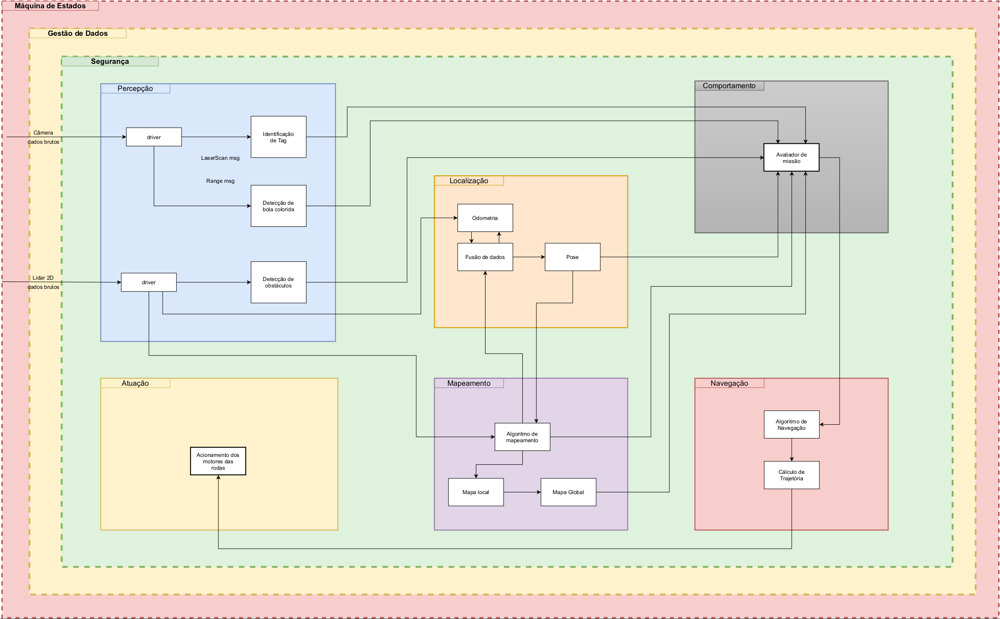
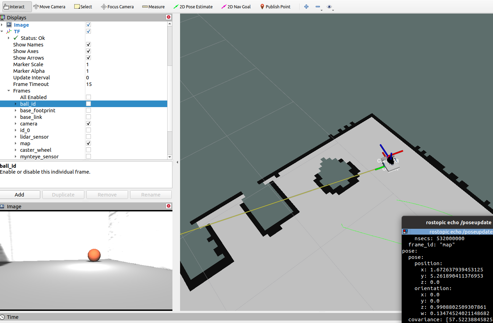

## Introdução
<!-- 
 -->
O projeto Hunter envolveu a concepção de um robô diferencial não-holonômico que tinha como objetivo navegar autonomamente em um ambiente estruturado, realizando a localização e mapeamento  simultâneos (SLAM, do inglês)  e identificando objetos nesse ambiente através de visão computacional. O robô foi desenvolvido na plataforma Robot Operating System (ROS), sendo executada em uma Jetson Nano Developer Kit. 
<!--   -->

  

## Objetivos e Requisitos
O desafio consistia na exploração do ambiente para localizar um marcador fiducial. Ao localizar esse marcador fiducial (TAG), o robô teria informação da posição de uma esfera colorida de cor laranja no ambiente. Os requisitos do cliente exigiam que o robô fosse autônomo, com capacidade de desviar de obstáculos, identificar objetos e capaz de mapear o ambiente. A partir disso foram escolhidos os requisitos técnicos, que foram:
* Capacidade de Processamento
* Cartão de memória com armazenamento adequado
* Capacidade de memória volátil
* Consumo energético
* Tensão de alimentação
* Possuir câmera
* Sensor de distância para mapeamento
* Utilizar SLAM
* Implementar estratégia de desvio de obstáculos
* Utilizar biblioteca de visão computacional
* Utilizar framework de robótica
* Utilizar bateria que permita autonomia de 15 minutos
* Componentes complementares com orçamento adequado

## Funcionalidades

O projeto foi dividido em seis funcionalidades para ser possível solucionar o desafio de forma sistemática: percepção, atuação, localização, mapeamento, comportamento e navegação. 

A funcionalidade de percepção é composta pelos sensores responsáveis por captar as informações do mundo externo, sendo eles as câmeras, sensor ultrassônico e LiDar. A câmera RGB ficou responsável pela identificação dos objetos, o sensor ultrassônico e o LiDar ficaram responsáveis pela detecção de objetos e a câmera estéreo que é acompanhada de uma IMU ajudou no cálculo de acelerações atuando no corpo e suas velocidades angulares. Foi utilizado o pacote bir_marker_localization para o reconhecimento da TAG e foi desenvolvido um script em pyhton utilizando a biblioteca open_cv para realizar a identificação da esfera colorida.

A funcionalidade de localização e a funcionalidade de mapeamento são implementas através do pacote hector_slam, que realiza o SLAM através do sensor de escaneamento LiDar. Com ele é possível obter o mapa do ambiente e também obter a odometria do sistema. Como a partir da localização do marcador fiducial é possível obter a posição da esfera no ambiente, que é o objetivo final, essa funcionalidade é de extrema importância. 

A funcionalidade de comportamento é implementada através de uma máquina de estados desenvolvida em C++. No início da operação o robô busca o marcador fiducial com uma rotina de deslocamentos e giros. Ao encontrar o marcador, ele rotaciona em direção ao objetivo final, que é a esfera, e realiza o deslocamento em direção a ele. Ao localizar a esfera, ele captura a imagem dela e encerra sua missão.

A funcionalidade de navegação, responsável pelo deslocamento do robô de um ponto inicial até um ponto final foi implementada através de um script em python, de forma que o robô primeiro se orienta em direção ao seu objetivo com uma rotina de giro, depois se desloca em linha reta em direção ao mesmo. Se ele identificar algum obstáculo em sua trajetória, ele interrompe sua ação, traçando uma nova trajetória.

A atuação do robô é responsável pelo acionamento dos motores. Foi desenvolvido um driver para os motores em C++, considerando a saturação dos atuadores, já que eles operam na faixa de 3 a 5 Volts. A ponte H é alimentada pelas baterias e seu controle é feito através de modulação em largura de pulso, PWM.

{:.center}
 

<!-- 

  

 -->

## Resultados

A concepção da plataforma hunter foi executada com sucesso, ocorrendo a integração de todos componentes no sistema desenvolvido, com exceção da bateria. Sendo assim, foram cumpridos todos requisitos técnicos com exceção da autonomia de 15 minutos.

O desafio foi primeiramente solucionado em ambiente de simulação, sendo escolhido a plataforma Gazebo. 

{:.center}
 

<!-- 

  

 -->

A execução da missão em ambiente de simulação foi bem sucedida, incluindo a navegação com a utilização do move_base, que não foi implementado com sucesso na parte prática. As funcionalidades abordadas foram implementadas e integradas com sucesso, entretanto a funcionalidade de desvio de obstáculos não foi implementada na prática, ficando a navegação com essa deficiência.

Como trabalhos futuros, pode-se melhorar a funcionalidade de navegação, tentando executar o pacote move_base ou o move_base_flex e também fazer a utilização das baterias para o robô poder navegar sem a utilização de cabos.

 
<iframe src ="https://drive.google.com/file/d/1lsui6OT8HB1tbBrajTYrLRbfQX_0f2AB/preview" width='740' height='430' allowfullscreen mozallowfullscreen webkitallowfullscreen></iframe>
 

---------------------
 

<!-- autor -->

<h3 class="post-title">Autor</h3> 

  

    <table class="table-borderless highlight">
      <thead>
        <tr>
          <th></th>
        </tr>
      </thead>
      <tbody>
        <tr class="font-weight-bolder" style="text-align: center margin-top: 0">
          <td>Mateus Seixas</td>
        </tr>
        <tr style="text-align: center" >
          <td style="vertical-align: top"><small>Pesquisador Jr. do projeto  Engenheiro Eletricista</small></td>
          <td></td>
        </tr>
      </tbody>
    </table>
  

 