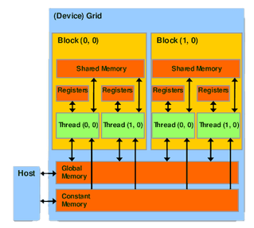

## O que é CUDA? Porque utilizar?

CUDA, acrônimo de Compute Unified Device Architecture, é um modelo de programação em paralelo que permite o uso das GPUs (Graphics Processing Unit) para processamento de dados em programas. As GPUs são dispositivos que possuem enorme poder de processamento para dados em paralelo, como processamento de imagens e matrizes, e sua capacidade de processamento tem aumentado muito superiormente a capacidade de processamento das CPUs nos últimos anos, como mostrado na figura a seguir. Com o uso dessa ferramenta, muitos problemas complexos podem ser resolvidos com um menor tempo de execução. 

{:.center}
[](../assets/img/2021-12-15-cuda-mini-curso/gpuvccpu.png)

A programação em CUDA pode ser utilizada em diversas aplicações que envolvem processamento de muitas informações em paralelo, como processamento de imagens, simulações, cálculos matriciais e vetoriais, algoritmos de busca, química computacional, ordenação, inteligência computacional, deep learning, entre outros.

## Diferenças entre CPU e GPU

As CPUs tem uma grande parte da área do chip dedicada a unidades de controle e de memória cache e possui apenas algumas Unidades Lógicas Aritméticas (ULA), sendo seu maior objetivo diminuir a latência. Enquanto isso, as GPUs possuem a maior parte de sua área de silício preenchidas por ULAs, que funcionam como CUDA cores. As CPUs são desenvolvidas para executar programas de propósito geral, como sistemas operacionais, enquanto as GPUs são desenvolvidas para programas que irão executar a mesma operação em um grande número de dados em paralelo. 

{:.center}
[](../assets/img/2021-12-15-cuda-mini-curso/Cpu-gpu.svg)

## Conceitos Básicos

Um código que é chamado pelo programa principal para ser executado na GPU é chamado de Kernel. A execução desse Kernel sobre um pedaço dos dados que acontece em um CUDA Core é chamada de Thread. As Thread são organizadas em conjuntos chamados de Blocks, que são executados em uma Streaming Multiprocessor (SM). Os blocks são agrupados em um conjunto chamado de Grid, que é executado em toda GPU a partir do launch do Kernel.
<br>
A programação em CUDA é chamada de programação heterogênea, pois é dividida em duas partes separadamente. As partes do código que são sequenciais são executadas pela CPU, chamada de Host, e a partes do código que terão execuções em paralelo são executadas pela GPU, chamada de Device.

{:.center}
[](../assets/img/2021-12-15-cuda-mini-curso/threadblock.png) 

## Modelo de Memória

A memória de uma GPU é composta por memória global, memória local por Thread, memória compartilhada. O Device (CPU) se comunica com o Host (GPU) através da memória global por um barramento PCI-Express. Threads em um mesmo Block podem se comunicar umas com as outras através da memória compartilhada. Elas podem trocar informações e se sincronizar, ou seja, podem trabalhar cooperativamente. Cada CUDA Core tem uma memória local exclusiva e um conjunto de registradores necessários para fazer a execução da Thread. Existe também uma memória constante, que é uma memória apenas de leitura, que podem ser declarados parâmetros fixos que podem ser utilizados em um programa com muita frequência, como o número pi, por exemplo.

<!-- {:.center}
[](../assets/img/2021-12-15-cuda-mini-curso/MEMORYY.png) -->
<center>
  
</center>

## Comando Básicos

É necessário declarar o Kernel no início do programa escrevendo qual operação ele irá executar. O kernel mínimo é mostrado no comando a seguir:

```cpp
__global__ void mykernel(...){
}  
```

A keyword __global__ indica que a função será executada no Device. O compilador de programas em CUDA, o nvcc (Nvidia CUDA Compiler) separa o código em componentes de Host, para as execuções sequenciais, e componentes de Device, para execuções em paralelo. Os componentes de Host são compilados com o compilador padrão gcc (GNU Compiler Collection) e os componentes de Device são compilados pelo nvcc.
<br><br>
É necessário fazer a alocação da memória do Device para ser feita a execução do Kernel na GPU. 

`cudaMalloc()` → Aloca espaço para cópias no Device
<br>

`cudaMemcpy()` → Copia entradas do Host pro Device ou do Device pro Host
<br>

`cudaFree()` → Desaloca memória no Device
<br><br>
## cudaMalloc() e cudaFree()

```cpp
cudaMalloc(LOCATION, SIZE);
cudaMalloc((void **)&d_a, sizeof(int));
```

O primeiro argumento do cudaMalloc é localização da memória no device que serão alocados os dados e o segundo argumento é o tamanho dos dados em bytes. Para desalocar a memória que foi alocada para a variável d_a, executa-se o seguinte código:

```cpp
cudaFree(d_a);
```
<br>
## cudaMemcpy()

```cpp
cudaMemcpy(dst,src,size,direction);
cudaMemcpy(d a, a, size,cudaMemcpyHostToDevice);
```

O primeiro argumento é o pointer do endereço que vai receber a cópia e o segundo argumento é o pointer do endereço que vai enviar a cópia. O terceiro argumento é o tamanho em bytes do dado a ser enviado. O quarto argumento é a direção que o dado está sendo enviado, que pode ser cudaMemcpyHostToDevice quando a transferência for do Host pro Device e cudaMemcpyDeviceToHost quando a transferência for do Device pro Host.

## Launch do Kernel

Para executar o código que será executado na GPU, ou Kernel, deve-se executar o launch do mesmo. No launch do Kernel são declaradas as dimensões dos Blocks e a dimensão do Grid. Os Blocks e os Grids podem ser até tridimensionais. 

```cpp
dim3 grid size(x,y,z);
dim3 block size(x,y,z);
kernel<<<grid size, block size>>>(...);
```

O primeiro parâmetro é a dimensão do Grid e o segundo parâmetro é a dimensão do Block.

## Instalando CUDA no Ubuntu 20.04

Para instalar o compilador de códigos CUDA em um computador Ubuntu, versão 20.04, deve-se executar os seguintes comandos:

```sh
$ sudo apt update
$ sudo apt install build-essential
$ sudo apt install nvidia-cuda-toolkit
```

O segundo comando instala o compilador GCC, GNU Compiler Collection, o compilador de códigos em C/C++ e o terceiro comando
instala o compilador NVCC, Nvidia CUDA Compiler.

## Compilando Códigos e executando

```sh
$ nvcc -o hello hello.cu
$ ./hello
```

O primeiro comando compila o programa em CUDA. Os programas em CUDA terminam em .cu. O segundo comando executa o comando.

## Atividade Hands-on

Foi desenvolvida uma atividade para colocar em prática os aprendizados adquiridos nessa seção. A plataforma que estão as atividades é o Google Colab, no [link](https://colab.research.google.com/drive/1TwbGMFXA6L-UThDeQEWhyKwo_M_jX_xD?usp=sharing). A atividade pode ser desenvolvida na própria plataforma, sendo necessário habilitar a utilização da GPU na aba Edit > Notebook Settings, escolhendo GPU na opção "Hardware accelerator", como mostrado nas figuras. E após habilitar a GPU, executar todos os comandos lá presentes em sequência.

<center>
  
</center><br>
<center>
  
</center>
<br>
## Apresentação de Slides
<br>
<iframe src ="https://drive.google.com/file/d/1frjP0Ii0Pn2LD8gK0hKrGB0vo79kKWPe/preview" width='740' height='430' allowfullscreen mozallowfullscreen webkitallowfullscreen></iframe>
<br>

---------------------
<br>

<!-- autor -->
<center><h3 class="post-title">Autor</h3><br/></center>
<div class="row">
  <div class="col-xl-8 offset-xl-0 col-lg-4 offset-lg-0 center">
    <table class="table-borderless highlight" style="background: #00000000">
      <thead>
        <tr>
          <th></th>
        </tr>
      </thead>
      <tbody>
        <tr class="font-weight-bolder" style="text-align: center margin-top: 0">
          <td>Lucas Lins</td>
        </tr>
        <tr style="text-align: center" >
          <td style="vertical-align: top; text-align: justify"><small>Pesquisador Jr. no laboratório de Robótica e Sistemas Autônomos, SENAI CIMATEC, Engenheiro Eletricista</small></td>
          <td></td>
        </tr>
      </tbody>
    </table>
  </div>
</div>

<br>