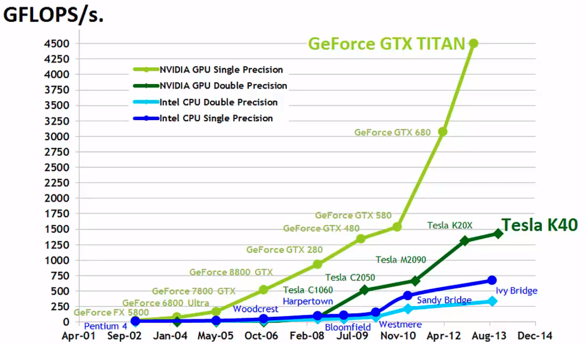

## O que é CUDA? Porque utilizar?

CUDA, acrônimo de Compute Unified Device Architecture, é um modelo de programação em paralelo que permite o uso das GPUs (Graphics Processing Unit) para processamento de dados em programas. As GPUs são dispositivos que possuem enorme poder de processamento para dados em paralelo, como processamento de imagens e matrizes, e sua capacidade de processamento tem aumentado muito superiormente a capacidade de processamento das CPUs nos últimos anos, como mostrado na figura a seguir. Com o uso dessa ferramenta, muitos problemas complexos podem ser resolvidos com um menor tempo de execução. 

{:.center}
 

A programação em CUDA pode ser utilizada em diversas aplicações que envolvem processamento de muitas informações em paralelo, como processamento de imagens, simulações, cálculos matriciais e vetoriais, algoritmos de busca, química computacional, ordenação, inteligência computacional, deep learning, entre outros.

## Diferenças entre CPU e GPU

As CPUs tem uma grande parte do sua área de silício dedicada a unidades de controle e de memória cache e possui apenas algumas Unidades Lógicas Aritméticas (ULA). Enquanto isso, as GPUs possuem a maior parte de sua área de silício preenchidas por ULAs.

{:.center}
 

<!-- A linguagem CUDA é praticamente C/C++ com algumas extensões. Sendo que é possível usar o recurso  -->

  

 

 
<iframe src ="https://drive.google.com/file/d/1bdZ56AsbMFPB-PsMLYJCUCNfLarYLGr3/preview" width='740' height='430' allowfullscreen mozallowfullscreen webkitallowfullscreen></iframe>
 

---------------------
 

<!-- autor -->

<h3 class="post-title">Autor</h3> 

  

    <table class="table-borderless highlight">
      <thead>
        <tr>
          <th></th>
        </tr>
      </thead>
      <tbody>
        <tr class="font-weight-bolder" style="text-align: center margin-top: 0">
          <td>Mateus Seixas</td>
        </tr>
        <tr style="text-align: center" >
          <td style="vertical-align: top"><small>Pesquisador Jr.  Engenheiro Eletricista</small></td>
          <td></td>
        </tr>
      </tbody>
    </table>
  

 