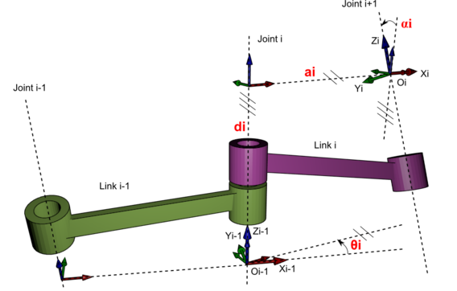
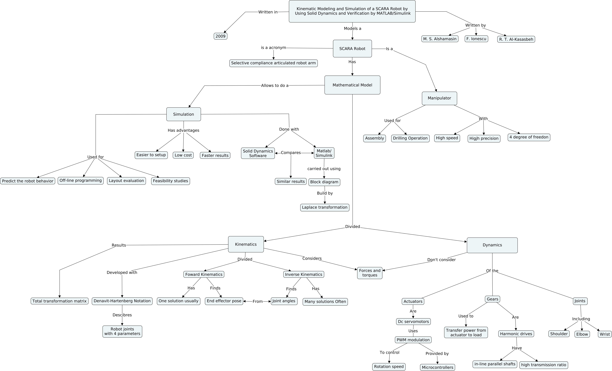

## Artigo Estudado

O artigo de base para o estudo desenvolvido foi o **"Kinematic Modeling and Simulation of a SCARA Robot by Using Solid Dynamics and Verification by MATLAB/Simulink"**, escrito por Mahdi Salman Alshamasin, Florin Ionescu e Riad Taha Al-Kasasbeh, publicado no ano de 2009 no European Journal of Scientific Research.
 
O artigo se propõe a realizar a modelagem de um manipulador do tipo **SCARA**, que é um acrônimo para Selective Compliance Articulated Robot Arm, com 4 graus de liberdade, através da **notação de Denavit-Hartenberg**. Os robôs SCARA são manipuladores com alta velocidade e precisão, sendo, dentro da classe dos manipuladores, os com maior repetibilidade e reprodutibilidade. Suas principais aplicações são de montagem e de perfuração, podendo ser usadas para confecção de eletrônicos, linha de montagem, aparafusamento, entre outros. 
 
Com o modelo do robô SCARA obtido, é então feita a comparação da simulação do robô em dois ambientes de simulação, o **Solid Dynamics Software (SD Software)** e o **Simulink** do **Matlab**. No SD Software é possível simular o robô declarando as juntas e as medidas dos elos, e no Matlab é necessário obter a transformada de laplace das equações que descrevem o sistema e construir um diagrama de blocos no Simulink.

  

 

## Notação de Denavit-Hartenberg

A notação de Denavit-Hartenberg é um método para descrever cada junta de um robô manipulador com apenas 4 parâmetros com objetivo de obter a cinemática direta e a cinemática inversa desse sistema. A cinemática direta permite calcular a pose (posição e orientação) do end effector do manipulador a partir dos ângulos e deslocamentos das juntas. Já a cinemática inversa se propõe a calcular os ângulos e deslocamentos das juntas necessários para que o end effector do manipulador esteja em uma determinada pose. Geralmente a cinemática direta tem apenas uma solução, enquanto a cinemática inversa pode encontrar algumas soluções para o mesmo problema.
 
Nos métodos convencionais de modelagem de um robô manipulador são necessários 6 parâmetros para descrever cada junta, os 3 deslocamentos lineares e os 3 deslocamentos angulares, entretanto, como o método de Denavit-Hartenberg leva em consideração algumas restrições, é possível definir uma junta em quarto parâmetros: ângulo de rotação ($\theta$), deslocamento da junta (d), comprimento do ele (a) e ângulo de torção ($\alpha$). 

{:.center}
 

## Resultados e Conclusão da Pesquisa

Na pesquisa foi desenvolvido o modelo completo de um robô do tipo SCARA através da notação de Denavit-Hartenberg, que é uma forma simples de obter a modelagem de um robô desse tipo. Foram obtidas as equações de cinemática direta e cinemática inversa. As simulações feitas nos dois ambientes, o SD Software e o Simulink do Matlab, validaram a modelagem realizada no artigo, como mostrado nas imagens que seguem, sendo a primeira imagem o resultado do Matlab e a segunda, o resultado do SD Software, para um experimento que o ângulo de rotação da primeira junta variava de 0.232 a 2.4695 rad e o da segunda junta de 1.3521 a 2.0944 rad. Foram feitos mais dois experimentos, que também obtiveram resultados iguais para a simulação em ambas ferramentas.

  

 

  

## Mapa Conceitual e Apresentação de Slides

Foi desenvolvido um mapa conceitual para facilitar a compreensão dos conceitos envolvidos no artigo citado, mostrando as conexões entre palavras-chave, permitindo uma apresentação mais visual do estudo. Foi desenvolvida também uma apresentação de slides com os assuntos aqui abordados.

{:.center}
 

 
<iframe src ="https://drive.google.com/file/d/1bdZ56AsbMFPB-PsMLYJCUCNfLarYLGr3/preview" width='740' height='430' allowfullscreen mozallowfullscreen webkitallowfullscreen></iframe>
 

---------------------
 

<!-- autor -->

<h3 class="post-title">Autor</h3> 

  

    <table class="table-borderless highlight">
      <thead>
        <tr>
          <th></th>
        </tr>
      </thead>
      <tbody>
        <tr class="font-weight-bolder" style="text-align: center margin-top: 0">
          <td>Mateus Seixas</td>
        </tr>
        <tr style="text-align: center" >
          <td style="vertical-align: top"><small>Pesquisador no laboratório de Robótica e Sistemas Autônomos (RoSA), Senai Cimatec, mestrando em Engenharia Elétrica e amante da natureza.</small></td>
          <td></td>
        </tr>
      </tbody>
    </table>
  

 