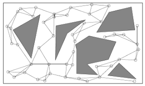

## Introdução

Foi feita a implementação do algoritmo de planejamento de trajetória Probabilistic Roadmap (PRM) em um robô diferencial não-holonômico chamado Turtlebot3
para permitir a navegação autônoma desse robô. Os testes foram realizados em ambiente
de simulação e em um labirinto real construído.

## Probabilistic Roadmap

O algoritmo Probabilistic Roadmap (PRM) é um planejador de trajetória que permite que um robô se desloque de um ponto inicial a um ponto final sem a interferência de um operador evitando a colisão com obstáculos. A ideia do planejador é gerar pontos aleatórios no mapa, verificando se esses pontos são espaços livres ou não, e tentando conectar eles com os outros pontos mais próximos já gerados, caso não tenha nenhuma barreira entre esses pontos. A medida que o número de pontos cresce, vão se formando trajetórias entre todos os espaços livres do mapa.

<!-- {:.center}
 -->

  

 

## Turtlebot3

O Turtlebot3 é um robô diferencial não-holonômico desenvolvido pela empresa Robotis e
tem como o ambiente de desenvolvimento padrão o ROS (Robot Operating System). O
Turtlebot3 tem como unidade central de processamento uma Raspberry Pi e o sistema
operacional instalado nela foi o Ubuntu 20.04 com o ROS Noetic. O modelo escolhido para esse desenvolvimento foi o Waffle Pi, que conta o motor DYNAMIXEL (XM430-W210-T) e
uma câmera Raspberry Pi, componentes que o diferenciam do modelo Burger, além do
seu formato. O Turtlebot3 conta com um sensor de escaneamento a laser LiDar, uma
OpenCR, módulo Bluetooth e uma beteria Li-Po. 

  

 

## Desenvolvimento

Foi realizada a montagem do Turtlebot3 e feita o tutorial disponível no [link](https://emanual.robotis.com/docs/en/platform/turtlebot3/quick-start/). Foi instalada a imagem do Ubuntu 20.04 na Raspberry Pi, o ROS Noetic, as dependências necessárias e os pacotes do Turtlebot3 ros-noetic-dynamixel-sdk,ros-noetic-turtlebot3-msgs e o ros-noetic-turtlebot3.

Foi encontrado um pacote no GitHub no [link](https://github.com/mwswartwout/turtlebot_prm) que implementa o planejador PRM como Plugin no ROS. O pacote foi desenvolvido para outra versão de ROS, foram necessário fazer algumas modificações no mesmo e também instalar algumas dependências necessárias: occupancy_grid_utils, ros_noetic_tf2_bullet, ros_noetic_ompl e ros_noetic_ompl_dbgsym. Para selecionar o PRM como planejador global do Move Base é necessário alterar o parâmetro base_global_planner do pacote turtlebot3_navigation para o PRM. O algoritmo foi testado em ambiente de simulação (Gazebo) e também na prática, em um labirinto construído.

  

 

  

 

## Conclusão

O estudo realizado trouxe maior entendimento sobre as funcionalidades de planejamento de trajetória e navegação, além de trazer conhecimento sobre o funcionamento do planejador Probabilistic Roadmap. Em ambiente de simulação o planejador teve bons resultados, porém na prática, para algumas trajetórias mais complicadas, o planejador não conseguiu obter solução, mas conseguiu lidar bem com trajetórias simples. Alguns parâmetros do move_base podem ser ajustados para encontrar um melhor resultado da implementação do algoritmo. Para trabalhos futuros o serão implementadas os ajustes dos parâmetros e o resultado obtido com esse planejador será comparado com outros planejadores, como A*, D* e Dijkstra, para comparar seus resultados estatisticamente.

---------------------
 

<!-- autor -->

<h3 class="post-title">Autor</h3> 

  

    <table class="table-borderless highlight">
      <thead>
        <tr>
          <th></th>
        </tr>
      </thead>
      <tbody>
        <tr class="font-weight-bolder" style="text-align: center margin-top: 0">
          <td>Mateus Seixas</td>
        </tr>
        <tr style="text-align: center" >
          <td style="vertical-align: top"><small>Pesquisador no laboratório de Robótica e Sistemas Autônomos (RoSA), Senai Cimatec, mestrando em Engenharia Elétrica e amante da natureza.</small></td>
          <td></td>
        </tr>
      </tbody>
    </table>
  

 
