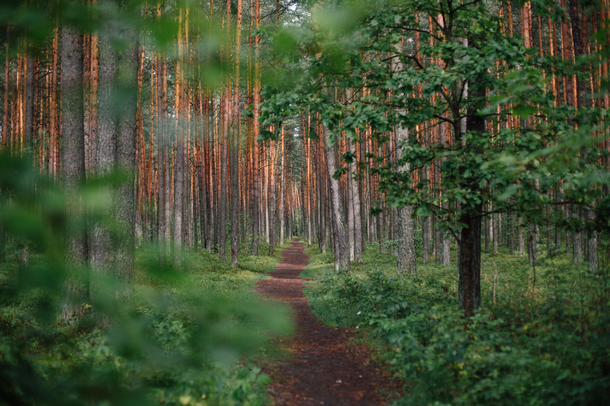

<!-- ## Introdução -->

Um tempo livre sempre é esperado, somos imbuídos em esperar pelo final de semana intensamente.
Esperamos em preenchê-lo com afazeres que criamos em nossos deleites substanciais e superficiais.

A efemeridade fala mais alto, e o passageiro é algo ainda mais momentâneo. 

E o aproveitar se torna primordial para uma vida existencialista do agora.

{:.center}
 
*Photo by <a href="https://unsplash.com/@krisroller?utm_source=unsplash&utm_medium=referral&utm_content=creditCopyText">Kristopher Roller</a> on <a href="https://unsplash.com/s/photos/sky?utm_source=unsplash&utm_medium=referral&utm_content=creditCopyText">Unsplash</a>*

Nos últimos 5 dias a gripe me levou a permanecer enfraquecido em cima de uma cama, entre uma febre e outra fui levado a refletir sobre como eu estava preenchendo meus dias de tempo livre. 
Encontrei inquietações que me fizeram a pensar sobre este tempo, que estava fluindo entre os meus dedos sem ao menos ter erigido uma torre de observação sobre o meu futuro.

### O Caminho
Somos insignificantes diante do universo, mas bucólicos para nossa família. Importantes para os que ficam aqui na Terra.

O enredo da vida nos levará, ao final do primeiro ato, a um encontro com Tânato. E isso será doloroso.

Mas ainda não é o fim.

A transcendência da alma é eterna, e anseia pela busca espiritual do **Caminho**. O único e verdadeiro caminho.

{:.center}
 
*Photo by <a href="https://unsplash.com/@ugnehenriko?utm_source=unsplash&utm_medium=referral&utm_content=creditCopyText">Ugne Vasyliute</a> on <a href="https://unsplash.com/s/photos/path?utm_source=unsplash&utm_medium=referral&utm_content=creditCopyText">Unsplash.</a>*

Neste ano, nosso grupo ousou saltar no vazio, em buscar uma reflexão mais humanizada. Passamos por discussões e leituras ([A Sociedade da Transparência](https://www.amazon.com.br/Sociedade-transpar%C3%AAncia-Byung-Chul-Han/dp/8532654711), [Identidade](https://www.amazon.com.br/Identidade-Entrevista-Benedetto-Zygmunt-Bauman/dp/8571108897/ref=sr_1_5?__mk_pt_BR=%C3%85M%C3%85%C5%BD%C3%95%C3%91&crid=162UCE8CLVOT&keywords=identidade&qid=1640656294&s=books&sprefix=identidade%2Cstripbooks%2C206&sr=1-5) e [O Jeito Harvard de Ser Feliz](https://www.amazon.com.br/Jeito-Harvard-Ser-Feliz/dp/8502180266/ref=sr_1_1?crid=D9IBSYJB1FO5&keywords=o+jeito+harvard+de+ser+feliz&qid=1640656338&s=books&sprefix=o+jeito%2Cstripbooks%2C217&sr=1-1)) que mexeram com nossos ideais, nossas bases dicotômicas e nossas visões de mundo. 

Eu espero que o ano de 2022 seja de mais preces abnegadas de prazer, pois a sociedade esta inundada na efemeridade do ter, e somos agentes da mudança.

#### Mudança de um mundo melhor. 
Este é o meu desejo. Que isso torne-se um feitiço, que entre em seu corpo e transforme de dentro para fora. Perceba que somos as palavras que os outros plantaram em nós. E isso é bem parecido com a fala do grande poeta português Fernando Pessoa: *Sou o intervalo entre o meu desejo e aquilo que os desejos dos outros fizeram de mim.*

### Somos resultado de um enorme feitiço.

E se você me acompanhou até aqui, eu espero que o seu tempo seja ainda mais reflexivo sobre a mudança. A mudança da sociedade. A mudança da família. 
> A minha e a tua mudança.  

Comecemos nós, pois muitos já alcançaram o *Nirvana*, e atrás estamos sós. 
.

Pensando sobre tudo isso, acabei encontrando um video de 15 minutos, que coincidentemente ([Jung](https://pt.wikipedia.org/wiki/Carl_Gustav_Jung) diria que é [**sincronicidade**](https://pt.wikipedia.org/wiki/Sincronicidade)) trazia aspectos sobre o que eu estava pensando. Veja e reflita.

<!-- 

<iframe width="560" height="315" src="https://www.youtube.com/embed/hv5wpw6h9hc?controls=0" title="YouTube video player" frameborder="0" allow="accelerometer; autoplay; clipboard-write; encrypted-media; gyroscope; picture-in-picture" allowfullscreen></iframe>

 -->

<iframe width="720" height="405" src="https://www.youtube.com/embed/hv5wpw6h9hc" title="YouTube video player" frameborder="0" allow="accelerometer; autoplay; clipboard-write; encrypted-media; gyroscope; picture-in-picture" allowfullscreen="true"></iframe>

 

#### O tempo livre de final de ano
hummm... desejo um 2022 de muito tempo livre, alegrias... mudanças e ... preces.

{:.center}

 

<!-- detalhamento -->

 

<!--
## Simulação
Como o projeto está em desenvolvimento, simulações parciais estão sendo testadas (referência).

 

## Live Action
Testes preliminares também estão sendo realizados em laboratório, onde alguns resultados foram alcançados.

 
-->

<!-- autor -->

<h3 class="post-title">Autor</h3> 

  

    <table class="table-borderless highlight">
      <thead>
        <tr>
          <th></th>
        </tr>
      </thead>
      <tbody>
        <tr class="font-weight-bolder" style="text-align: center margin-top: 0">
          <td>Marco Reis</td>
        </tr>
        <tr style="text-align: center" >
          <td style="color: #808080; vertical-align: top; text-align: justify"><small>Pesquisador em Robótica no Centro de Competências em Robótica e Sistemas Autônomos do Senai Cimatec. Apaixonado por robótica e um idealista puro, vive motivando aqueles que caminham em direção ao sucesso. Atualmente segue o interesse do seu coração realizando pesquisa na área de robótica, coordenando projetos acadêmicos e escrevendo ficção. Marco é formado em engenharia elétrica pela UFPR e mestrado em engenharia de produção pela UFSC. E aguarda anciosamente o Winds of Winter.</small></td>
          <td></td>
        </tr>
      </tbody>
    </table>
  

 
